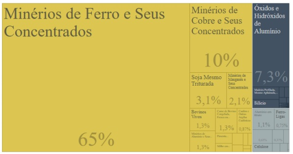

<h1>Uma análise do desmatamento da Amazônia Legal (2004-2019)</h1>
<h4>Gustavo Duregger, gustavo.duregger@gmail.com</h4>

<h5>  A Amazônia é a maior floresta tropical do planeta terra, é uma área de
5 500 000 km² contidas em 9 países, dentre eles: Brasil (60%), Peru (19%),
Colômbia, Venezuela, Equador, Bolívia, Guiana Suriname e Guiana Francesa.
No Brasil, a Amazônia é delimitada por uma área chamada de “Amazônia Legal”.
Para o estudo utilizaremos como base os dados do INPE que realiza
monitoramento por satélite na Amazônia Legal a partir do PRODES. Será feito
estudos em relação ao desflorestamento da região ao longo dos anos de 2004 a
2019 e sua possível causa utilizando dados de desflorestamento entre 1999 a
2018 comparando com os nichos econômicos dos estados com maior índice de
desmatamento.</h5>

<h3>Desflorestamento da Amazônia Legal</h3>
<h5>  O Desflorestamento é o processo de destruir florestas, causado
principalmente por atividades humanas. Abaixo temos uma tabela com a área²
de desflorestamento separado por estado brasileiro ao longo dos anos.</h5>

<h6>Fonte INPE (Instituto de Pesquisas Espaciais), de 18 de novembro de 2019</h6>
<h5>Ao plotar um gráfico de linhas pra entender como está agindo o
desmatamento conforme os anos se passam percebe-se o seguinte fenômeno:</h5>

<h6>Imagem 1 – Gráfico de desflorestamento da Amazônia Brasileira (2004-2019)
</h6>
<h5>Perceba inicialmente os altos índices de 2004 e 2005, os anos que mais
se desmatou no Brasil, onde teve a grande explosão da soja, que ocorreu devido 
a uma serie de isenções fiscais e estímulos para que houvesse determinado
crescimento econômico em cima de commodities, causando grande
desflorestamento em regiões como Pará e Rondônia.</h5>

<h6>Imagem 2 – Gráfico de desflorestamento da Amazônia Brasileira (1998-2015)
</h6>
<h5>Veja também que até 2012 houve queda nos índices, mas que após isso
houve um crescente aumento possuindo picos de alta no ano 2016 e
principalmente no ano de 2019 criando uma tendência de aumento em 2020.
É importante destacar que florestas são um recurso limitado, portanto
quanto mais ocorre desflorestamento, menos área de floresta há para se
desflorestar. Percebe-se esse fato ao analisar Mato Grosso.</h5>

<h6>Imagem 3 – Gráfico de desflorestamento da Amazônia Brasileira indicando maior pico
por estado (2004-2019)
</h6>
<h5>Perceba que Mato Grosso possui o maior valor registrado na tabela
(2004).
Agora veja que proporcionalmente, Mato Grosso foi o estado da região
que teve maior queda nos índices desflorestamento, mas isso ocorre por que
existem muito poucas áreas restantes para se desflorestar.</h5>

<h6>Imagem 4 – Gráfico de desflorestamento da Amazônia Brasileira ressaltando Mato
Grosso (2004-2019)
</h6>
<h5>Portanto pode-se concluir que o desflorestamento na região amazônica é
sim preocupante, a tendência está para que os índices aumentem ainda mais
nos próximos anos. Diante aos fatos, podemos questionar qual o grande
causador desses desflorestamentos. Uma maneira de se descobrir o
potencializador de desflorestamento é verificar a correlação entre os nichos de
encomia nos estados que mais se foi desmatado.</h5>
<h5>Mato Grosso: Extrativismo Vegetal, Agropecuária. (Produtos básicos)</h5>

<h6>Imagem 5 – Gráfico demonstrando predominância de exportação em Mato
Grosso(2019)</h6>
<h5>Pará: Extrativismo Mineral, Agropecuária. (Produtos básicos)</h5>

<h6>Imagem 6 – Gráfico demonstrando predominância de exportação no Pará (2019)</h6>
<h5>Rondônia: Agropecuária. (Produtos básicos)</h5>

<h6>Imagem 6 – Gráfico demonstrando predominância de exportação em Rondônia (2019)</h6>
<h5>Há um padrão de nicho econômico entre os estados que mais
desflorestam a floresta amazônica, a Agropecuária. Diante do fato podemos
verificar se há uma causalidade a partir de testes de modelo e hipótese,
correlação e verificação de normalidade de dados.
Utilizaremos dados do abate de cabeça de gado por estado e exportação
(valor FOB) de produtos básicos para métricas de extrativismo mineral e vegetal
e pecuária.</h5>
<h3>TESTE ESTATÍSTICO DE CAUSALIDADE ENTRE PECUÁRIA E
DESFLORESTAMENTO (1999-2018)</h3>
<h5>Utilizando os abates como eixo x e desflorestamentos como eixo y se
obtém os seguintes resultados:</h5>

<h5>Perceba que R² está indicando uma correlação muito forte (0,96), se
utilizarmos uma regressão logarítmica o R² fica ainda maior (0,97), veja o valor-
P, também indicando uma forte correlação e a plotagem de resíduos de forma
aleatória.
Diante das informações, fica evidente a contribuição da Pecuária no
desflorestamento da floresta amazônica entre os anos de 1999 a 2018.</h5>
<h3>TESTE ESTATÍSTICO DE CAUSALIDADE ENTRE PRODUTOS BÁSICOS E
DESFLORESTAMENTO (2008-2014)</h3>

<h5>Novamente o R² está indicando uma correlação forte (0,86), o valor-P
também indicando uma forte correlação.</h5>
<h3>CONSIDERAÇÕES FINAIS</h3>
<h5>Foi observado pela análise que, apesar de termos registros de maiores
índices no desflorestamento da Amazônia Legal no passado, os atuais índices
são alarmantes devido a menor área disponível florestada e a linha de tendência
crescendo rapidamente, principalmente ao analisar o estado do Pará.
Percebemos uma forte correlação entre produtos básicos e o desflorestamento
da área, indicando uma possível causalidade entre as variáveis, principalmente
em relação a produção de gado, que trouxe maior correlação comparado com
outros produtos básicos, seguido da produção de soja e do extrativismo mineral.</h5>
<h3>REFERÊNCIAS</h3>
<h5>Monitoramento do Desmatamento da Floresta Amazônica Brasileira por Satélite,
Disponível em:
<http://www.obt.inpe.br/OBT/assuntos/programas/amazonia/prodes> Acesso:
10/01/2020.</h5>
<h5>MESQUITA, Benjamin Alvino de.Desenvolvimento agrícola na Amazônia
Legal: a dinâmica recente do agro-negócio e os impactos na agricultura familiar,
no extrativismo do babaçu, no desmatamento e na segurança alimentar no
Maranhão.Projeto de Pesquisa. São Luís: UFMA, 2008.</h5>
<h5>Brandão, Antonio Salazar Pessoa; Rezende, Gervásio Castro de; Marques,
Roberta Wanderley da Costa. Crescimento Agrícola no Brasil no período
1999-2004: explosão da soja e da pecuária bovina e seu impacto sobre o meio
ambiente. Texto para discussão nº 1103. Julho de 2005.</h5>
<h5>World of Change: Amazon Deforestation, Disponivel em:
<https://earthobservatory.nasa.gov/world-of-change/Deforestation> acesso:
11/01/2020.</h5>
<h5>What’s the current deforestation rate in the Amazon rainforest?, Disponivel
em: <https://infoamazonia.org/en/2015/05/whats-the-current-deforestation-ratein-the-amazon-rainforest/#!/story=post-12897> Acesso: 11/01/2020.</h5>
<h5>TerraBrasilis (INPE), Disponivel em:
<http://terrabrasilis.dpi.inpe.br/app/dashboard/alerts/legal/amazon/daily/>
Acesso: 11/01/2020.</h5>
<h5>Imagens mostram avanço do garimpo ilegal na Amazônia em 2019
, Disponivel em: <https://www.bbc.com/portuguese/brasil-49053678> Acesso:
12/01/2020.</h5>
<h5>Pesquisa Trimestral do Abate de Animais, Disponivel em:
<https://sidra.ibge.gov.br/tabela/1092> Acesso: 12/01/2020.</h5>
<h5>Comex Vis: Estado , Disponivel em: <http://www.mdic.gov.br/comercioexterior/estatisticas-de-comercio-exterior/comex-vis/frame-uf-produto?>
Acesso: 12/01/2020.</h5>

